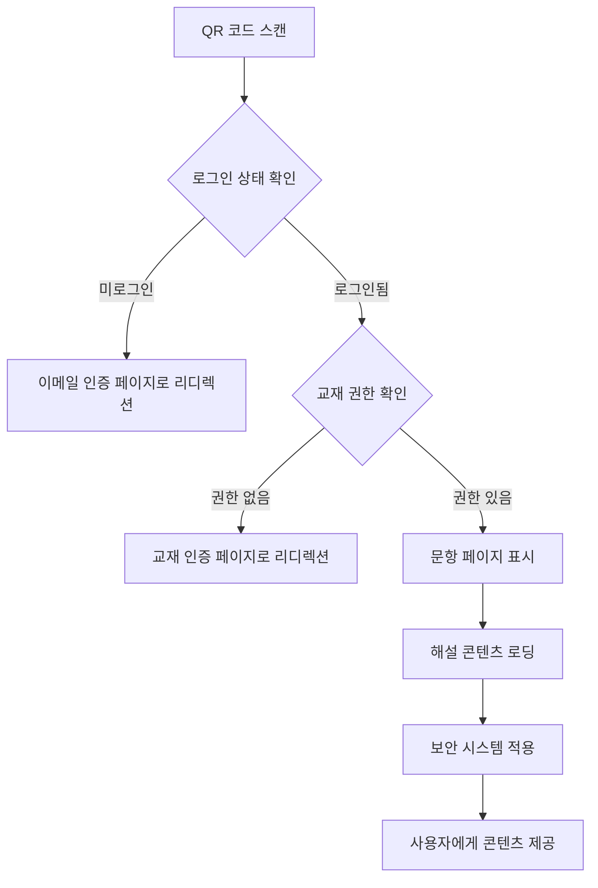

# 📚 GSG (Cloudflare Pages)

안전하고 정확한 수학 교재 해설을 제공하는 웹 플랫폼입니다. 이메일 OTP 인증과 실물 교재 기반 소유권 증명을 통해 콘텐츠 접근을 관리합니다.

## 🏗️ 프로젝트 구조 및 아키텍처

### 📁 전체 프로젝트 구조

```
gsg/
├── 📂 dist/                    # 빌드된 정적 파일들
│   ├── index.html             # 메인 HTML 파일
│   └── assets/                # CSS, JS, 폰트 등 정적 자산
│
├── 📂 functions/              # Cloudflare Pages Functions (백엔드 API)
│   ├── _middleware.ts         # 미들웨어 (보안 헤더, 세션 관리)
│   └── api/                   # API 엔드포인트들
│       ├── auth/              # 인증 관련 API
│       │   ├── otp/           # OTP 발급 및 검증
│       │   ├── session/       # 세션 관리
│       │   └── logout.ts      # 로그아웃
│       ├── challenge/         # 교재 인증 챌린지
│       ├── security/          # 보안 모니터링 및 Rate Limiting
│       └── admin/             # 관리자 기능
│
├── 📂 src/                    # 소스 코드 (React + TypeScript)
│   ├── 📂 components/         # 재사용 가능한 컴포넌트들
│   │   ├── ContentLayout.tsx  # 콘텐츠 레이아웃 (사이드바, 툴바)
│   │   ├── ContentProtection.tsx # 콘텐츠 보호 (우클릭 방지 등)
│   │   ├── DynamicWatermark.tsx # 동적 워터마크
│   │   ├── EnhancedMathRenderer.tsx # 고급 수식 렌더러
│   │   ├── ErrorBoundary.tsx  # 에러 바운더리
│   │   ├── FontSizeControl.tsx # 폰트 크기 조절
│   │   ├── LazyMathRenderer.tsx # 지연 로딩 수식 렌더러
│   │   ├── LoadingSpinner.tsx # 로딩 스피너
│   │   ├── MathBlock.tsx     # 수식 블록 컴포넌트
│   │   ├── MathText.tsx      # 텍스트 내 수식 렌더링
│   │   ├── MathRenderer.tsx  # 기본 수식 렌더러
│   │   ├── ProgressIndicator.tsx # 진행률 표시
│   │   ├── ReadingModeToggle.tsx # 읽기 모드 토글
│   │   ├── SecurityDashboard.tsx # 보안 대시보드
│   │   ├── SecurityMonitor.tsx # 보안 모니터
│   │   ├── ServiceFeatures.tsx # 서비스 특징 표시
│   │   ├── ThemeToggle.tsx   # 테마 토글 (다크/라이트)
│   │   ├── WatermarkProvider.tsx # 워터마크 제공자
│   │   └── WelcomeHero.tsx   # 환영 메시지 히어로 섹션
│   │
│   ├── 📂 hooks/              # 커스텀 React 훅들
│   │   ├── useMathRenderer.ts # 수식 렌더링 훅
│   │   └── useSecurityMonitor.ts # 보안 모니터링 훅
│   │
│   ├── 📂 lib/                # 유틸리티 및 설정 파일들
│   │   ├── api/               # API 클라이언트 함수들
│   │   ├── auth/              # 인증 관련 유틸리티
│   │   ├── constants.ts       # 상수 정의
│   │   ├── content-protection.ts # 콘텐츠 보호 유틸리티
│   │   ├── math-utils.ts      # 수학 관련 유틸리티
│   │   ├── types.ts           # 타입 정의
│   │   ├── validators/        # 입력 검증 함수들
│   │   └── watermark-utils.ts # 워터마킹 유틸리티
│   │
│   ├── 📂 routing/            # 라우팅 설정
│   │   └── router.tsx         # React Router 설정
│   │
│   ├── 📂 server/             # 서버사이드 코드
│   │   ├── db/                # 데이터베이스 관련
│   │   │   ├── index.ts       # D1 데이터베이스 유틸리티
│   │   │   ├── migrations.json # 마이그레이션 정보
│   │   │   └── schema.sql     # 데이터베이스 스키마
│   │   ├── lucia/             # Lucia 인증 설정
│   │   └── services/          # 비즈니스 로직 서비스들
│   │       ├── email-service.ts # 이메일 발송 서비스
│   │       ├── otp-service.ts # OTP 관리 서비스
│   │       └── user-service.ts # 사용자 관리 서비스
│   │
│   ├── 📂 styles/             # 스타일 파일들
│   │   ├── fonts.css          # 폰트 설정
│   │   └── globals.css        # 전역 스타일 (Tailwind 포함)
│   │
│   ├── 📂 views/              # 페이지 컴포넌트들
│   │   ├── auth/              # 인증 관련 페이지들
│   │   │   ├── AuthEmailPage.tsx # 이메일 입력 페이지
│   │   │   └── AuthOtpPage.tsx # OTP 입력 페이지
│   │   ├── challenge/         # 챌린지 관련 페이지들
│   │   │   └── ChallengePage.tsx # 교재 인증 페이지
│   │   ├── explanation/       # 해설 관련 페이지들
│   │   │   └── ExplanationPage.tsx # 해설 표시 페이지
│   │   ├── LandingPage.tsx    # 랜딩 페이지
│   │   ├── loader/            # 라우트 로더
│   │   │   └── GuardedLoader.ts # 인증 가드 로더
│   │   ├── NotFoundPage.tsx   # 404 페이지
│   │   ├── RootLayout.tsx     # 루트 레이아웃
│   │   └── TestPage.tsx       # 테스트 페이지
│   │
│   ├── main.tsx               # React 앱 엔트리 포인트
│   └── assets/                # 에셋 파일들
│       └── fonts/             # 폰트 파일들
│
├── 📂 types/                  # 타입 정의 파일들
│   └── env.ts                 # 환경 변수 타입 정의
│
├── 📄 index.html              # 개발용 HTML 파일
├── 📄 package.json            # 패키지 설정 및 스크립트
├── 📄 tailwind.config.ts      # Tailwind CSS 설정
├── 📄 tsconfig.json           # TypeScript 설정
├── 📄 vite.config.ts          # Vite 설정
└── 📄 wrangler.toml           # Cloudflare 설정
```

## 🔧 기술 스택

### 프론트엔드
- **React 18** + **TypeScript** - 사용자 인터페이스
- **Tailwind CSS** - 스타일링
- **Vite** - 빌드 도구 및 개발 서버
- **React Router DOM** - 클라이언트 사이드 라우팅
- **@tanstack/react-query** - 서버 상태 관리
- **KaTeX** - 수학 공식 렌더링
- **clsx** + **tailwind-merge** - 조건부 스타일링

### 백엔드 (Cloudflare Pages Functions)
- **Hono** - 웹 프레임워크
- **Lucia Auth** - 인증 시스템
- **Cloudflare D1** - SQLite 데이터베이스
- **Cloudflare KV** - 키-값 저장소
- **Zod** - 스키마 검증

### 보안 및 성능
- **워터마킹 시스템** - 콘텐츠 무단 복제 방지
- **콘텐츠 보호** - 우클릭, 복사 방지
- **Rate Limiting** - API 남용 방지
- **Error Boundary** - 에러 처리
- **Performance Monitor** - 성능 모니터링

## 🔐 환경 변수 설정

배포 전에 다음 환경 변수를 설정해야 합니다:

### Cloudflare Dashboard에서 설정해야 하는 변수들

#### 1. D1 데이터베이스 설정
**파일 위치**: `wrangler.toml`
```toml
[[d1_databases]]
  binding = "DB"
  database_name = "gsg"
  database_id = "${D1_DATABASE_ID}"  # 실제 데이터베이스 ID로 교체
```

#### 2. KV 네임스페이스 설정
**파일 위치**: `wrangler.toml`
```toml
[[kv_namespaces]]
  binding = "OTP_KV"
  id = "${OTP_KV_ID}"  # 실제 KV 네임스페이스 ID로 교체

[[kv_namespaces]]
  binding = "SESSION_KV"
  id = "${SESSION_KV_ID}"  # 실제 KV 네임스페이스 ID로 교체

[[kv_namespaces]]
  binding = "SECURITY_KV"
  id = "${SECURITY_KV_ID}"  # 실제 KV 네임스페이스 ID로 교체

[[kv_namespaces]]
  binding = "RATE_LIMIT_KV"
  id = "${RATE_LIMIT_KV_ID}"  # 실제 KV 네임스페이스 ID로 교체
```

#### 3. 환경 변수들 (Environment Variables)
**파일 위치**: `wrangler.toml` 의 `[vars]` 섹션
```toml
[vars]
  ORIGIN = "${ORIGIN_URL}"           # 배포된 사이트 URL (예: https://your-site.pages.dev)
  TURNSTILE_SECRET = "${TURNSTILE_SECRET}"  # Cloudflare Turnstile 비밀키
  EMAIL_API_KEY = "${EMAIL_API_KEY}" # 이메일 서비스 API 키
  LUCIA_SESSION_SECRET = "${LUCIA_SESSION_SECRET}"  # Lucia 인증 세션 비밀키
  ADMIN_API_KEY = "${ADMIN_API_KEY}"  # 관리자 API 접근 키
```

### 환경 변수 설정 방법

#### Cloudflare Dashboard에서 설정:
1. **Cloudflare Pages 대시보드** → 프로젝트 선택
2. **Settings** 탭 클릭
3. **Environment variables** 섹션에서 다음 변수들 추가:
   - `D1_DATABASE_ID`: D1 데이터베이스 ID
   - `OTP_KV_ID`: OTP용 KV 네임스페이스 ID
   - `SESSION_KV_ID`: 세션용 KV 네임스페이스 ID
   - `SECURITY_KV_ID`: 보안 로그용 KV 네임스페이스 ID
   - `RATE_LIMIT_KV_ID`: Rate Limiting용 KV 네임스페이스 ID
   - `ORIGIN_URL`: 배포된 사이트 URL
   - `TURNSTILE_SECRET`: Cloudflare Turnstile 비밀키
   - `EMAIL_API_KEY`: 이메일 서비스 API 키
   - `LUCIA_SESSION_SECRET`: 랜덤 생성된 32바이트 문자열
   - `ADMIN_API_KEY`: 관리자용 API 키

#### 로컬 개발 환경 설정:
`.env.local` 파일 생성:
```env
D1_DATABASE_ID=your-database-id
OTP_KV_ID=your-otp-kv-id
SESSION_KV_ID=your-session-kv-id
SECURITY_KV_ID=your-security-kv-id
RATE_LIMIT_KV_ID=your-rate-limit-kv-id
ORIGIN_URL=http://localhost:5173
TURNSTILE_SECRET=your-turnstile-secret
EMAIL_API_KEY=your-email-api-key
LUCIA_SESSION_SECRET=your-session-secret
ADMIN_API_KEY=your-admin-api-key
```

## 🚀 배포 준비사항

### 1. Cloudflare 리소스 생성
다음 리소스들을 Cloudflare Dashboard에서 생성해야 합니다:

#### D1 데이터베이스
```bash
# Cloudflare CLI로 생성 (또는 대시보드에서 수동 생성)
npx wrangler d1 create gsg
```

#### KV 네임스페이스들
```bash
# OTP용 KV 네임스페이스
npx wrangler kv:namespace create "OTP_KV"

# 세션용 KV 네임스페이스
npx wrangler kv:namespace create "SESSION_KV"

# 보안 로그용 KV 네임스페이스
npx wrangler kv:namespace create "SECURITY_KV"

# Rate Limiting용 KV 네임스페이스
npx wrangler kv:namespace create "RATE_LIMIT_KV"
```

### 2. 이메일 서비스 설정
OTP 이메일 발송을 위해 이메일 서비스를 설정해야 합니다:

**권장 서비스들:**
- **Resend** (추천)
- **SendGrid**
- **AWS SES**
- **Mailgun**

### 3. Cloudflare Turnstile 설정
봇 방지를 위한 Turnstile 사이트키를 설정해야 합니다:

1. Cloudflare Dashboard → Turnstile
2. 사이트키 생성
3. `TURNSTILE_SECRET` 환경 변수에 설정

### 4. 데이터베이스 초기화
배포 후 데이터베이스를 초기화합니다:

```bash
# 로컬에서 마이그레이션 실행
npx wrangler d1 execute DB --local --file=./src/server/db/schema.sql

# 또는 프로덕션에서
npx wrangler d1 execute DB --file=./src/server/db/schema.sql
```

## 📝 해설 파일 작성 가이드

### 해설 파일 구조 및 위치

해설 파일들은 `src/content/` 폴더에 다음과 같은 구조로 저장됩니다:

```
src/content/
├── books/                 # 교재별 폴더
│   ├── algebra-1/        # 대수학 1 교재
│   │   ├── metadata.json # 교재 메타데이터
│   │   └── problems/     # 문항별 폴더
│   │       ├── p001/     # 1번 문항
│   │       │   ├── question.md   # 문항 내용
│   │       │   ├── solution.md   # 해설 내용
│   │       │   └── metadata.json # 문항 메타데이터
│   │       └── p002/     # 2번 문항
│   │           ├── question.md
│   │           ├── solution.md
│   │           └── metadata.json
│   └── geometry/         # 기하학 교재
│       └── problems/     # 동일한 구조
└── index.json            # 전체 콘텐츠 인덱스
```

### 각 파일의 상세 구조

#### 1. 교재 메타데이터 (`metadata.json`)
```json
{
  "id": "algebra-1",
  "title": "대수학 1",
  "author": "김수학",
  "publisher": "수학출판사",
  "isbn": "978-89-1234-567-8",
  "totalPages": 350,
  "totalProblems": 150,
  "difficulty": "고등학교 1학년",
  "subjects": ["대수학", "방정식", "함수"],
  "qrCodePrefix": "ALG1",  // QR 코드 접두사
  "createdAt": "2024-01-01T00:00:00Z",
  "updatedAt": "2024-01-01T00:00:00Z"
}
```

#### 2. 문항 내용 (`question.md`)
```markdown
# 문항 1-1 (p. 16, 1번)

다음 방정식을 풀어라:

$$2x + 3 = 7$$

## 난이도
초급

## 관련 개념
- 일차방정식
- 이항계수

## 키워드
방정식, 해, 변수
```

#### 3. 해설 내용 (`solution.md`)
```markdown
# 해설: 문항 1-1

## 문제 분석
주어진 방정식 $2x + 3 = 7$에서 $x$의 값을 구해야 합니다.

## 풀이 과정

### 단계 1: 상수항 이동
$$2x = 7 - 3$$
$$2x = 4$$

### 단계 2: 계수 제거
$$x = \frac{4}{2}$$
$$x = 2$$

## 답안
$$x = 2$$

## 추가 설명
이 문제는 기본적인 일차방정식의 풀이법을 확인하는 문제입니다.
```

#### 4. 문항 메타데이터 (`metadata.json`)
```json
{
  "id": "p001",
  "bookId": "algebra-1",
  "page": 16,
  "problemNumber": 1,
  "difficulty": "초급",
  "estimatedTime": "2분",
  "concepts": ["일차방정식", "이항계수"],
  "keywords": ["방정식", "해", "변수"],
  "qrCode": "ALG1-001-016-001",  // QR 코드 값
  "relatedProblems": ["p002", "p005"],  // 관련 문항들
  "createdAt": "2024-01-01T00:00:00Z",
  "updatedAt": "2024-01-01T00:00:00Z"
}
```

### 해설 페이지 구현 방법

#### 1. 동적 라우팅 설정
`src/routing/router.tsx`에 다음 라우트 추가:

```typescript
{
  path: "/problem/:bookId/:problemId",
  element: <ProblemPage />,
  loader: GuardedLoader,
}
```

#### 2. ProblemPage 컴포넌트 구현
```typescript
// src/views/ProblemPage.tsx
import { useParams } from "react-router-dom";
import { useQuery } from "@tanstack/react-query";
import { fetchProblemContent } from "@/lib/api/problems";

export const ProblemPage = () => {
  const { bookId, problemId } = useParams<{ bookId: string; problemId: string }>();

  const { data: problem, isLoading } = useQuery({
    queryKey: ["problem", bookId, problemId],
    queryFn: () => fetchProblemContent(bookId!, problemId!),
  });

  if (isLoading) return <LoadingSpinner />;

  return (
    <ContentLayout title={`문항 ${problem?.metadata.problemNumber}`}>
      <div className="space-y-8">
        {/* 문항 내용 */}
        <div className="prose max-w-none">
          <MathText>{problem?.question}</MathText>
        </div>

        {/* 해설 내용 */}
        <div className="prose max-w-none">
          <h2 className="text-2xl font-bold mb-6">해설</h2>
          <MathText>{problem?.solution}</MathText>
        </div>
      </div>
    </ContentLayout>
  );
};
```

#### 3. API 함수 구현
```typescript
// src/lib/api/problems.ts
export const fetchProblemContent = async (bookId: string, problemId: string) => {
  // 실제로는 서버 API 호출 또는 정적 파일 로딩
  const response = await fetch(`/api/problems/${bookId}/${problemId}`);
  return response.json();
};
```

## 📱 QR 코드 기반 접근 시스템

### QR 코드 구조
각 문항별 QR 코드는 다음과 같은 형식으로 생성됩니다:

```
https://your-site.pages.dev/problem/{bookId}/{problemId}
```

**QR 코드 생성 예시:**
- 교재 ID: `algebra-1`
- 문항 ID: `p001`
- QR 코드 URL: `https://your-site.pages.dev/problem/algebra-1/p001`

### QR 코드 생성 방법

#### 1. QR 코드 라이브러리 설치
```bash
npm install qrcode @types/qrcode
```

#### 2. QR 코드 생성 유틸리티
```typescript
// src/lib/qr-generator.ts
import QRCode from 'qrcode';

export const generateProblemQR = async (
  bookId: string,
  problemId: string,
  size: number = 256
): Promise<string> => {
  const url = `${window.location.origin}/problem/${bookId}/${problemId}`;
  return QRCode.toDataURL(url, { width: size });
};
```

#### 3. 문항 페이지 접근 제어
QR 코드로 접근 시 다음 검증을 수행합니다:

1. **인증 확인**: 사용자가 로그인 상태인지 확인
2. **권한 확인**: 해당 교재에 대한 접근 권한 확인
3. **콘텐츠 로딩**: 문항 내용과 해설 로딩
4. **보안 적용**: 워터마킹 및 콘텐츠 보호 적용

### 문항별 접근 흐름



## 🔐 보안 고려사항

### 콘텐츠 보호 시스템
- **워터마킹**: 사용자 이메일 기반 동적 워터마크
- **복사 방지**: 우클릭, 텍스트 선택, 키보드 단축키 차단
- **스크린샷 방지**: CSS를 통한 시각적 보호
- **개발자 도구 감지**: 의심스러운 활동 모니터링

### 접근 제어
- **세션 기반 인증**: Lucia Auth를 통한 안전한 세션 관리
- **Rate Limiting**: API 호출 제한으로 남용 방지
- **입력 검증**: Zod를 통한 모든 입력값 검증
- **CORS 설정**: 적절한 출처 정책 적용

## 🚀 배포 및 운영

### Cloudflare Pages 배포
```bash
# 빌드 및 배포
npm run build
npx wrangler pages deploy dist
```

### 데이터베이스 마이그레이션
```bash
# 프로덕션 데이터베이스에 스키마 적용
npx wrangler d1 execute DB --file=./src/server/db/schema.sql
```

### 모니터링 및 로그
- **보안 이벤트**: SECURITY_KV에 로그 저장
- **사용자 활동**: 데이터베이스에 접근 기록
- **성능 지표**: PerformanceMonitor 컴포넌트에서 확인

이 문서는 프로젝트의 전체 구조와 운영 방법을 상세히 설명합니다. 추가 질문이 있으시면 언제든지 문의해주세요! 📚✨
